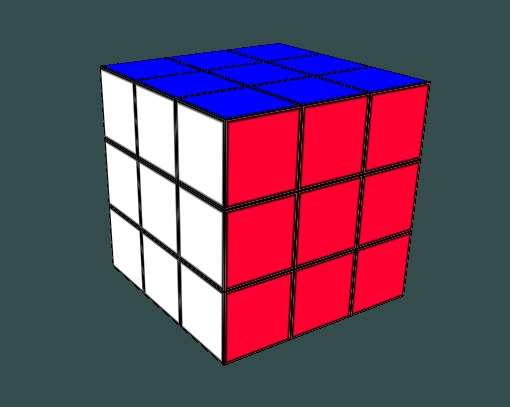

## Rubik's Cube Animation

Some practice with Graphics using OpenGL and C++

### Sample

#### To-do
1) add layer rotation and refactor

### Credits

Joey de Vries for for inspiration and guidance while learning OpenGL through his site [here](https://learnopengl.com).